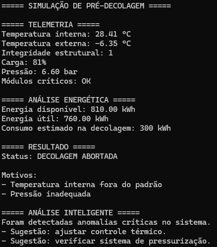

#  Sistema de Pré-Decolagem

##  Descrição
Simulação de um sistema que verifica condições para decolagem com base em telemetria.

##  Funcionalidades
- Geração de dados aleatórios
- Verificação de segurança
- Diagnóstico do sistema
- Apresenta sugestões de resolução

##  Como executar
1. Instale Python
2. Execute: simulacao_pre_decolagem.py

## Exemplo de execução

## Autor
Guilherme